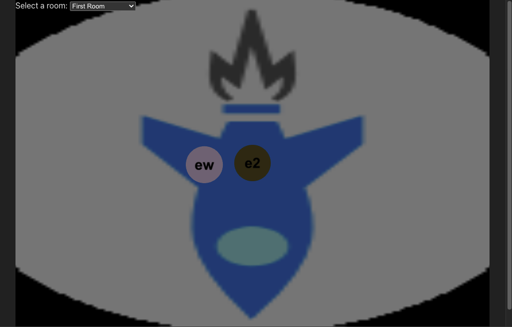

# Boost UI Background Issue Example Start
In this exercise, we have introduced a defect with unkown reproduction steps.  The assignment is to determine how to reproduce the defect.  If you wish, you can also perform root cause analysis and identify failed assumptions.  The solution is in the `final` folder.

## App Decription
This is a social app where users can get together and have avatars with voice and video chat as well as share content.  At this stage, the functionality that has been implemented is limited to multiple users having avatars that can be moved around the room.  We have begun to implement a feature called "boost".  The boost feature is intended to allow users to express appreciation for the actions or words of another user.  The boost feature is activated when a user clicks on another users boost UI, which looks like a rocket.  The boost feature has a cooldown before it can be used again for that user. 

## Running the example
To run the example:
1.  Cd to the server directory
1.  Run `npm start`
1.  Cd to the client directory
1.  Run `npm run dev`
1.  Open the browser to the address provided when you started the client under "local" (likely `localhost:5173`)
1.  For this defect, you will need a second user.  You can open a second tab on the same browser, or you can open a browser on a second device to the address under "network"

## Defect Observations
The following are the observations that have been made about this defect
1.  It occurs when there are two or more users in the same room
1.  At some point the room background will be replaced by the image from the boost UI, screenshot below:
